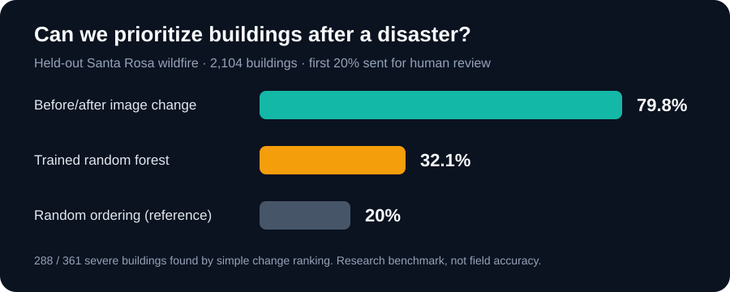

# Disaster Damage Triage

**Status: reproducible research prototype with ten disaster-level holdouts and a local review demo.** This project is a building-review prioritization experiment, not an operational damage assessment system.



On a held-out Santa Rosa wildfire sample, reviewing the top 20% of buildings ranked by simple before/after pixel change surfaced **288 of 361 severely damaged buildings (79.8%)**. A trained random forest surfaced **116 of 361 (32.1%)**. Across ten held-out disasters, results vary sharply: the simple ranking's event-level recall ranges from **0% to 79.8%**. This is an honest research result, not a field-performance claim.

## Try the interface

The app opens without the large xBD archive. It shows the real aggregate results and all-event scorecard, plus an interactive **synthetic** image set for trying a blind review queue and error gallery. The synthetic example is visibly marked and is not included in the research metrics. If you also have local xBD predictions, the review desk, error gallery, and explorer use the real local crop pairs. Review decisions are saved in a local SQLite file; there is no login or image upload.

### Run on another computer

Download or clone this repository. Install **Python 3.10 or newer** and use the launcher for your operating system:

- Windows: double-click `run-demo.cmd`.
- macOS/Linux: run `sh run-demo.sh` from this folder.

The launcher creates a private `.venv`, installs the app, and opens Streamlit in your browser. The **first setup needs internet** to download Python packages; subsequent launches use the installed environment and can run offline. It does not download xBD. If your computer restricts scripts, use the manual commands below. A computer without compatible Python, package-install permission, or a supported browser needs those prerequisites first; this is not a standalone executable.

The app writes generated synthetic images and review decisions under `results/`, which Git ignores. To use actual imagery, prepare xBD on that computer and point `TRIAGE_RESULTS_DIR` to its prediction folder. Predictions created on a different PC contain absolute image paths and need to be regenerated or path-adjusted when moved.

### Manual launch

```powershell
pip install -e ".[demo]"
streamlit run demo.py
```

For the full xBD explorer, run the data preparation and training steps below, then launch the app from the same repository. If your results live elsewhere, set `TRIAGE_RESULTS_DIR` to that folder before starting Streamlit.

## Research question

Can a small image model rank buildings for human review after a disaster, and how well does it hold up on an **entire disaster event that it never saw during training**?

The first version uses **known building outlines** from the xBD labels. It classifies damage at those locations; it does not detect buildings in a new image. “Severe” means the xBD label is `major-damage` or `destroyed`. `no-damage` and `minor-damage` are the comparison class. Unclassified buildings are excluded.

## Why this dataset

The [Defense Innovation Unit's xView2 challenge](https://www.diu.mil/ai-xview-challenge) used satellite imagery to study disaster building-damage assessment. The [xBD dataset](https://xview2.org/dataset) contains before/after imagery, building outlines, and human damage labels. It is licensed **CC BY-NC-SA 4.0**. The dataset is research material; this repository does not redistribute it.

## What the pipeline does

1. Read xBD post-disaster JSON labels and matching before/after image tiles.
2. Crop each graded building at its known location, with surrounding context.
3. Extract transparent color and image-change features from both crops.
4. Rank buildings using a simple pixel-difference baseline and a random forest. An optional frozen ResNet-18 image encoder is available for further experiments; it is not part of the polygon-based result reported here.
5. Hold out all buildings from each disaster event in turn for testing.
6. Report precision, recall, average precision, and **recall among the top 20% of buildings sent for review**.
7. Explore predictions and errors in a local Streamlit demo.
8. Let a reviewer inspect before/after pairs without seeing the historical label, save a decision locally, then reveal the label for retrospective feedback.

## Obtain data and run

Register on the [official xBD download page](https://xview2.org/dataset), download the Challenge training images and labels, and extract them locally. A [public Hugging Face mirror of the training archive](https://huggingface.co/datasets/DrNerd/xBD-Training-Data) was used for the reported run; it contains the original image tiles and polygon JSON annotations, not the approximate semantic masks used in the earlier pilot. The code expects `images/` and `labels/` to be sibling folders somewhere below your data root. Each tile needs matching `*_pre_disaster.png`, `*_post_disaster.png`, and `*_post_disaster.json` files. The full archive is large; start with a subset containing several distinct disasters.

```powershell
py -m venv .venv
.\.venv\Scripts\Activate.ps1
pip install -e ".[demo,test]"
python -m disaster_triage.inspect_data --data-root C:\path\to\xBD
triage-prepare --data-root C:\path\to\xBD --out data\processed --max-tiles-per-event 30 --seed 42
triage-train --manifest data\processed\manifest.csv --test-event santa-rosa-wildfire --out results
triage-cross-validate --manifest data\processed\manifest.csv --out results\cross-event --feature-cache data\processed\features.npz
streamlit run demo.py
```

The command above reproduces the reported sample if you have the Challenge training archive. It samples up to 30 tiles per event with a fixed seed; Guatemala volcano has only 18 tiles in that archive. `--max-tiles-per-event` controls compute; remove it for a full-data study. The crop manifest contains local absolute paths and is intentionally excluded from Git.

The cross-validation command computes image features once and fits ten separate held-out-event models. It writes `event_metrics.csv`, `fold_predictions.csv`, and `summary.json` locally. The optional feature cache is reusable only with the same unchanged crop manifest; delete it if images or crops change.

For the optional image-encoder comparison, install the `vision` extra using the [PyTorch installation instructions](https://pytorch.org/get-started/locally/) appropriate to your hardware, then run:

```powershell
python -m disaster_triage.train_embeddings --manifest data\processed\manifest.csv --test-event YOUR_HELD_OUT_EVENT --out results-embeddings
```

### Pilot without an xView2 login

A public [xBD Parquet mirror](https://huggingface.co/datasets/EVER-Z/torchange_xView2) contains image pairs and semantic damage masks. `prepare_parquet.py` converts connected components of the building mask into approximate building crops. **Adjacent buildings can merge**, so these are not equivalent to the original polygon annotations. Install `pip install -e ".[mirror,demo,test]"` and run:

```powershell
python -m disaster_triage.prepare_parquet --parquet C:\path\to\train-0000.parquet --out data\pilot --max-tiles-per-event 8
triage-train --manifest data\pilot\manifest.csv --event-prefix hurricane- --test-event hurricane-michael --out results-pilot
```

The original xBD image license remains CC BY-NC-SA 4.0; the public mirror's packaging does not change that attribution. No dataset files are committed here.

## Polygon-based held-out result

The 30-tile-per-event sample contains **24,465 graded buildings from ten disasters**. The random forest trained on 22,361 buildings from nine events. All 2,104 buildings from Santa Rosa wildfire were reserved for testing; 361 were labeled `major-damage` or `destroyed`. The evaluation decision was a review budget of 20% of test buildings (421 buildings), not a claim of automatic diagnosis.

| Ranking method | Severe buildings found in first 421 reviews | Recall at 20% review | Average precision |
| --- | ---: | ---: | ---: |
| Mean absolute before/after pixel change | 288 / 361 | **79.8%** | **0.746** |
| Random forest on image summary/change features | 116 / 361 | 32.1% | 0.302 |

The large gap is evidence that this trained model does **not** generalize well to the unseen wildfire. It is not evidence that pixel change will work equally well on every disaster or in the field. The image pairs are already georegistered by the dataset, and changes can reflect shadows, seasonal differences, smoke, or viewpoint—not just damage. The simple score is a *priority for human review*, never a damage verdict. [Complete aggregate metrics](assets/held-out-metrics.json), including thresholded precision and recall, are committed for inspection; ranking metrics are primary because the task is triage.

## Cross-disaster scorecard

[All ten event results](assets/cross-event-metrics.csv) are committed as aggregate metrics; no xBD imagery or building-level predictions are published. Each fold uses the other nine events for training. At a 20% review budget, simple image change has **41.4% mean event recall** versus **26.1%** for the random forest. It wins on eight events, loses on Hurricane Matthew, and ties at zero on Mexico earthquake. These are *unweighted averages of event-level recalls*, not a pooled building-level rate. The seven severe labels among 8,074 sampled Mexico earthquake buildings make that event's percentage especially unstable. A 20% random-order queue would have 20% expected recall, but individual event comparisons vary.

The CSV also includes each event's severe-label prevalence, average precision, and a descriptive 95% range from 500 resamples of image **tiles**, rather than treating neighboring buildings as independent. Some ranges are very wide or reach 0–100%; they are not confidence guarantees about a new disaster. No method is reliable enough here for autonomous response use.

## Earlier mask-derived pilot

On a deliberately small mirror sample (8 image tiles per event), the model trained on Hurricanes Florence, Harvey, and Matthew and was tested on 707 approximate building components from Hurricane Michael. Of those components, 58 had a severe-damage mask label. Reviewing the top 20% ranked by **raw pixel difference** found 37.9% of the severe components. The random forest found 27.6%, and the frozen-image-encoder model found 15.5%. These are exploratory results from mask-derived components; they are **not** claims about the full xBD dataset or field performance. The result motivated the switch to original polygon labels and further error analysis.

## Evaluation rules

- Split by **whole disaster event**. A random building or tile split would leak neighboring imagery and event-specific visual patterns into the test set.
- Pick the held-out event before inspecting its model results. Do not tune model parameters on it.
- Report severe-damage recall alongside precision: a model that misses most damaged buildings is a weak triage aid, even if its overall accuracy looks high.
- Compare the model with the simple image-difference ranking. A trained model is useful only if it improves the relevant metric.
- Review false positives and false negatives visually. Shadows, smoke, viewing angle, and imprecise labels may be important failure modes.
- If the model performs poorly on the unseen event, report that plainly. Cross-disaster generalization is the core research question.

## Current limitations

This is a research demonstration, not an operational damage-assessment service. It assumes known building locations and uses a limited reproducible sample of the xBD training archive, not every tile or a separate external dataset. Even the ten-event study is retrospective and shows large variation; future disasters, imaging conditions, and geography may differ. The random forest uses handcrafted features and its default score is not calibrated. The error gallery lists **possible** explanations to inspect, not verified causes for each image. Dataset access, license terms, and image size are practical constraints. A future version should reserve a separate event for model selection, seek external validation, test calibration, and add independent building detection. None of those claims are implied by this result.

## Attribution

Dataset: xBD / xView2, Defense Innovation Unit and Carnegie Mellon Software Engineering Institute. See the [xBD project description](https://www.sei.cmu.edu/projects/xview-2-challenge/) and [official dataset terms](https://xview2.org/terms).

The code in this repository is under the [MIT license](LICENSE). That does not change the separate **CC BY-NC-SA 4.0** terms for xBD imagery and annotations; no xBD imagery or labels are redistributed here.

